# Genomics and Clinical Microbiology 2024

2 - 7 February 2025
 
Wellcome Genome Campus, Hinxton UK

## Topic: Bioinformatics

**Instructors: Dr. Keith Jolley, Dr. Made Krisna, Dr. Kasia Parfitt and Prof. Martin Maiden**

## Background

This module aims to introduce participants to bioinformatic analysis of molecular and genomic data.

## Learning outcomes

* Gain familiarity with the Linux operating system and command line;
* Understand the concepts of sequence alignment and tree building;
* Perform a bacterial genome assembly using the command line;
* Explore and analyse genomic datasets on PubMLST.

## Practical 1: Introduction to the Linux command line and BLAST

In this practical we will be introducing the Linux command line. Most bioinformatics tools run on Linux and so a familiarity with its use can be very helpful. To provide a real-world example of its power we will use the stand-alone BLAST package to create a local database that can be queried to identify a sequence. In this case we will construct a database of 16S sequences and use this to try to identify the species using sequences from four bacterial samples.

Commands are typed in to a console window. This is accessed in different ways on different versions of Linux, but there should be either a menu entry or icon for ‘console’ or ‘terminal’. For the Linux system used on the course this is highlighted below: 


We will be using a number of commands to navigate the Linux file system. Commands that appear in a box should be typed directly in to the console window, e.g.

```
ls *
```

**Linux is case-sensitive – it is important that commands are typed exactly as shown, including spaces.**

### Navigation
In this section we will gain a familiarity with the Linux commands used to navigate the file system and interact with files and directories. Type everything that appears in the boxes.

#### List files in your home directory.

List non-hidden files in your current directory:
```
ls
```	
List all files in your current directory:
```
ls -a
```
#### Change current directory to the root of the file system and explore the directory structure.

To go to the root (top-level) of the filesystem:
```
cd /
```
List non-hidden files in your current directory with extended information (file size, dates, owner). You can combine command attributes, e.g. (-a: show all; -l: show long information; -h: show human-readable file sizes):
```
ls -lh
```
Show the current directory (print working directory):
```
pwd
```
Change current directory to /home and list the contents:
```
cd /home
ls -l
```
Change to the parent directory and list the contents:
```
cd ..
ls -l
```
Go back to your home directory, list the contents, and check where you are in the file system hierarchical structure:
```
cd ~
ls
pwd
```
### Creating a BLAST database
Make sure that you are in your home directory:
```
cd
pwd
```
We are now going to create a directory where we will generate the BLAST database. To do this, we use the ``mkdir`` (make directory) command.
```
mkdir blast
```
To enter a directory, we use the ``cd`` command (change directory). Enter the newly created blast directory.
```
cd blast
```
Now we will obtain reference 16S sequences. These are available from the SILVA website (<https://www.arb-silva.de>) as a compressed file  (<https://www.arb-silva.de/fileadmin/silva_databases/release_132/Exports/SILVA_132_SSURef_Nr99_tax_silva.fasta.gz>). This URL has been shortened by tinyurl to <https://tinyurl.com/y7dh2htc>.  You can download files using the ``wget`` command.   

```
wget https://tinyurl.com/y7dh2htc --output-document=16S_ref.fasta.gz
```

 We can see the size of this file by using the ``ls`` command with the -l (long) -h (human-readable) arguments.
```
ls -lh
```
You should see something like the following:
> ``-rw-rw-r-- 1 keith keith 230M Dec 11  2017 16S_ref.fasta.gz``

The file size is 230MB.

Before we can use it, we need to uncompress it using the ``gunzip`` command. This is quite a large file and will therefore take a few seconds to uncompress.
```
gunzip 16S_ref.fasta.gz
```
When the file has finished uncompressing you will see that the file size is now much bigger and the .gz prefix has been removed from the filename.
```
ls -lh
```

> ``-rw-rw-r-- 1 keith keith 1.1G Dec 11  2017 16S_ref.fasta``

The file size is now 1.1GB.

You can look at the contents of this file using the ``less`` command. Scroll through the file using the space key, go back using the ‘b’ key and exit by pressing ‘q’. The file is in FASTA format, with taxonomic information in the header line for each sequence.
```
less 16S_ref.fasta
```
We can use this file to create a BLAST database against which we can query the specimen sequences. Creating the database will take about 2-3 minutes.
```
makeblastdb -in 16S_ref.fasta -dbtype nucl -out 16Sdb
```
Now if you list the contents of the directory, you should see 3 new files: 16Sdb.nhr, 16Sdb.nin and 16Sdb.nsq. These together comprise the BLAST database.

16S sequences have been generated for 4 specimens. You can download these from <https://github.com/WCSCourses/GCM24/raw/main/course_data/BLAST/16S.tar>.
```
wget https://github.com/WCSCourses/GCM24/raw/main/course_data/BLAST/16S.tar
```
This file is an uncompressed tar archive containing individual files for each specimen. Extract the files using the tar command.
```
tar xvf 16S.tar
```
If you now list the directory, you should see FASTA files for specimens 1-4.

Query each sequence against the newly-created BLAST database. As these are nucleotide sequences and the BLAST database has been created using nucleotide sequences, we should use the ``blastn`` command.
```
blastn -db 16Sdb -query specimen1.fas -out specimen1.out
```
View the output using the ``less`` command:
```
less specimen1.out
```
Scroll down until you come to the first alignment. Alignments are shown in score order so the better alignments are shown first. Can you identify the species?

Do the same for the other specimen files. You may wish to limit the number of results
```
blastn -db 16Sdb -query specimen2.fas -out specimen2.out -num_alignments 5
```

## Practical 2: Constructing phylogenetic trees

### Introduction to phylogenetic analysis
For these exercises we will be using the program MEGA (Molecular Evolutionary Genetics Analysis). This is a free application that will run on Windows, MacOS or Linux and is available from <https://megasoftware.net/>. The exercise will be run as an interactive session with a talk. Please stop and wait for the next part of the talk when you reach a stop sign:


You have been provided with a dataset that consists of the sequences of a gene for a collection of diverse *Mycobacteria* spp. isolates spanning the known diversity of the genus. You can find these sequences in https://github.com/WCSCourses/GCM24/tree/main/course_data/phylogenetics. Download the sequence data into your account to make it easy to drag-and-drop the files. To do this, open a terminal window and type (or copy and paste):

```
mkdir Desktop/phylogenetics
cd Desktop/phylogenetics
wget https://github.com/WCSCourses/GCM24/raw/main/course_data/phylogenetics/mycobacteria.fas
wget https://github.com/WCSCourses/GCM24/raw/main/course_data/phylogenetics/mycobacteria+C_diphtheriae.fas
```

You should now see a new folder on your desktop called 'phylogenetics' that contains two files. You will be able to drag-and-drop from here into the MEGA window later.

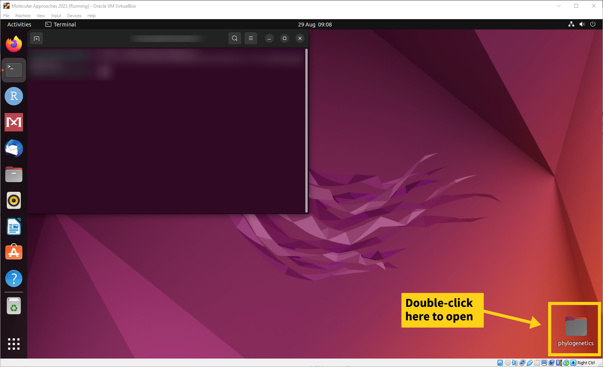

We will be looking at the *rplB* gene that encodes one of the proteins that make up the ribosome, the essential protein factory of the cell. Some ribosomal protein genes are involved in antibiotic resistance within *Mycobacteria*, and may therefore be under diversifying selection, but this gene is not. With its essential role we should, therefore, expect it to be relatively conserved within a species, making it a good candidate for phylogenetic analysis.

### Aligning and formatting data
The sequences have been provided in FASTA format. This is the simplest and probably most common format for sequence data. Each sequence within a FASTA file consists of a header line beginning with a ‘>’ character followed by the sequence identifier and optional comments separated by a ‘|’ character. The sequence itself appears on the following line(s) and continues until either the next header line (beginning with a ‘>’) or the end of the file, e.g.

```
>seq_1
TTTGATACTGTTGCCGAAGGTTTGGGCGAAATTCGCGATTTATTGCGCCGTTATCATCAT
GTCAGCCATGAGTTGGAAAATGGTTCGAGTGAGGCCTTATTGAAAGA
>seq_2
TTTGATACCGTTGCCGAAGGTTTGGGTGAAATTCGCGATTTATTGCGCCGTTACCACCGC
GTCGGCCATGAGTTGGAAAACGGTTCGGGTGAGGCTTTGTTGAAAGA
>seq_3
TTTGATACCGTTGCCGAAGGTTTGGGTAAAATTCGCGATTTATTGCGCCGTTACCACCGC
GTCGGTCATGAGTTGGAAAACGGTTCGGGTGAGGCTTTGTTGAAAGA
```
MEGA can read FASTA files. Sequences need to be aligned before they can be used to generate phylogenetic trees.

Run MEGA and open the mycobacteria.fas file now found in the phylogenetics folder on your desktop. 


You can either click the ‘Data’ button and then select the file, or simply drag-and-drop the file in to the main interface.

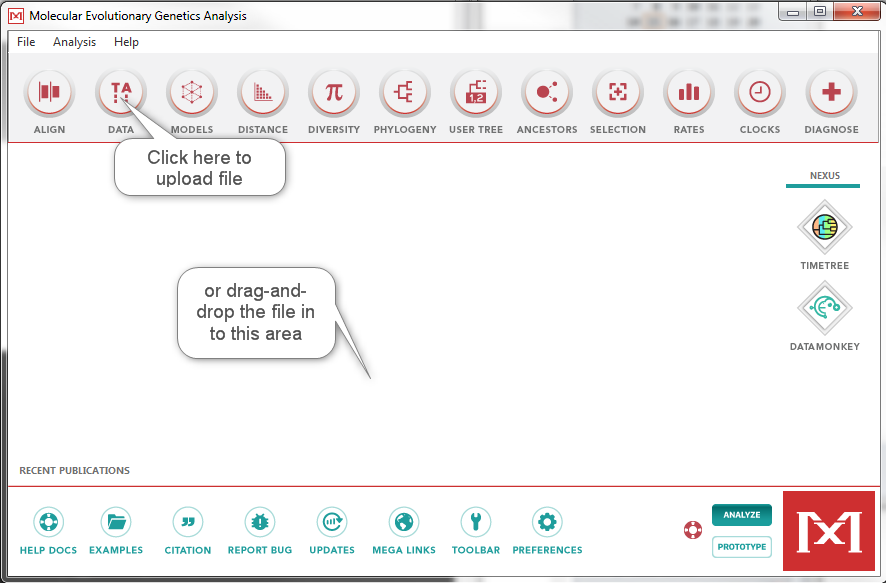

A dialog box will ask you whether to ‘Analyze or Align file’ – select ‘Align’.

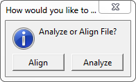

The sequences will be loaded in to the ‘Alignment explorer’ window.

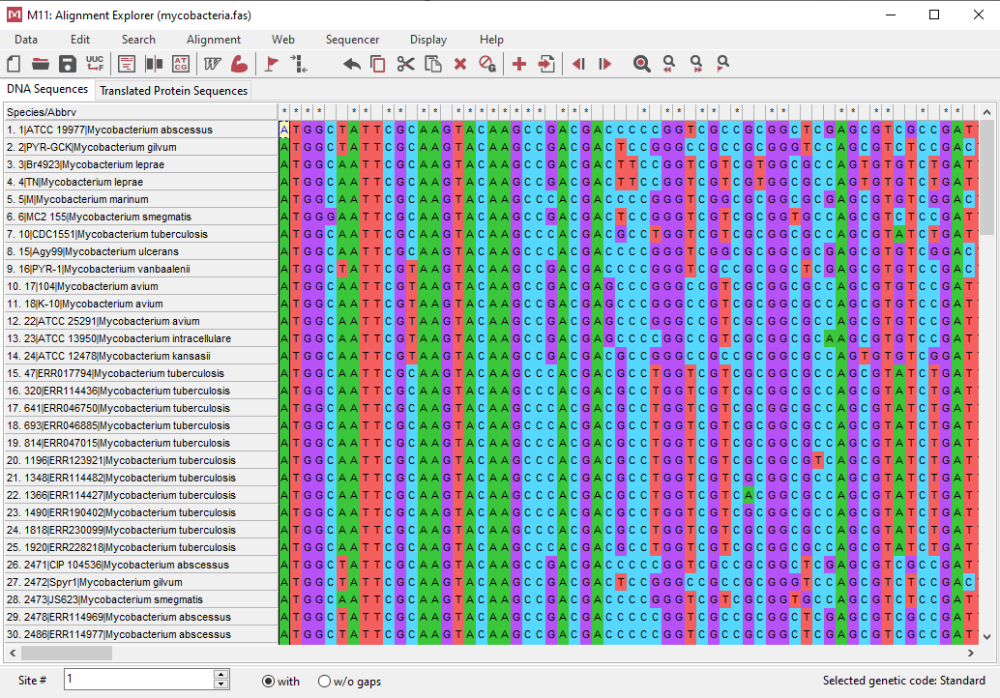

Select all the sequences by clicking ``Edit .. Select All``. 


Click the Alignment tab and select Align by MUSCLE (codons):


Aligning by codon takes account of the fact that these are protein-encoding sequences so the alignment is performed by first translating the codons to amino acids, performing the alignment, and then finally replacing the amino acids with the original codons. This will produce a more robust alignment for coding data than aligning individual nucleotides. 

Alignment options will appear. Leave the default values and click ‘OK’.

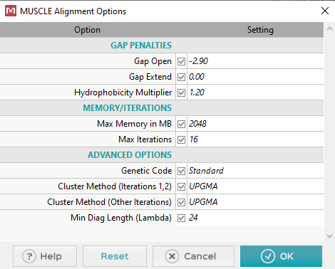

You will be asked whether you would like to remove gaps before alignment. Click ‘Yes’:

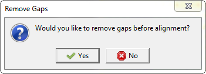

You will then get a warning that there are stop codons found in the translated sequences. Click 'Ignore' since these are at the ends of the gene and do not affect the alignment.


### Distances
You can now perform phylogenetic analysis. Click on the ‘Data’ tab and select ‘Phylogenetic Analysis’:


The data are protein encoding, so answer ‘Yes’ when asked:

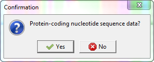

The aligned data are available in the main MEGA window.

In order to re-construct a tree from sequence data we need to calculate the genetic distances between each sequence. There are different ways of doing this, employing different evolutionary models. The simplest is the p-distance which is basically a count of the number of differences between two aligned sequences divided by the length of the sequences. Select ‘Distances’ in the main MEGA window and then select ‘Compute Pairwise Distances…’ in the dropdown menu.


You may be asked if you want to use the currently active file. Say 'yes'.

 

An ‘Analysis Preferences’ dialog will be displayed. Select  ‘p-distance’ in the Model/Method section leaving all other options at their default.


Click ‘OK’. A distance matrix will be calculated and displayed. The distance between sequences 1 (*M. abscessus*) and 2 (*M. gilvum*) is 0.1182795699. This corresponds to 99 nucleotide differences in a total shared length of 837 bases, i.e. (99/837).


If you re-calculate distances using a different model, you will see that the values are slightly different. Recalculate using the Jukes-Cantor model. The distance is now 0.1287197008. This difference is due to a multiple hit correction.


### Tree building
Now you can generate a Neighbor-Joining tree by selecting ‘Phylogeny’ in the main MEGA window and then ‘Construct/Test Neighbor-Joining Tree’.


Accept the default options and click ‘OK’.


A ‘Tree Explorer’ window will open. 


The rectangular tree can be misleading because by default it will root at the midpoint whereas the root may not be known. A radiation tree is often a better way to draw an unrooted tree because no assumption of the root is implied. You can show a radiation tree by clicking on the tree icon and selecting ‘Radiation’.


Switching off the labels will make the tree clearer. You can do this by unchecking the 'Taxon names' checkbox.

Often we will want to explicity root a tree using an outgroup – one or more nodes that we know to be more dissimilar than the other members of the tree. A second dataset has been provided that includes the same dataset with the addition of the rplB sequence from a Corynebacterium diphtheriae isolate.
Load the mycobacteria+C_diphtheriae.fas file, align it and generate a Neighbor-joining tree.


Now we can see where the root should be, as *Corynebacterium diphtheriae* is the most distance node in the tree. We can explicitly root the tree using this node by selecting the branch from *Corynebacterium diphtheriae* to the other isolates, right-clicking and selecting ‘Root’.

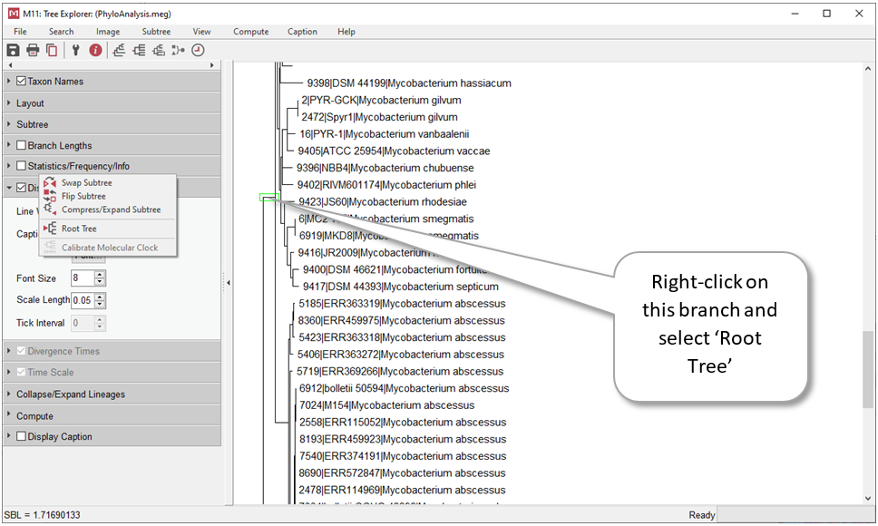


### Bootstrap tests
Bootstrapping is a way of testing the reliability of an inferred tree. It works by randomly replacing a subset of the data and testing whether the topology of a tree generated from these new sequences changes. If it does not then there is a strong signal supporting the topology and we can be more confident of the groupings. The test provides a percentage value for each branch of the tree.

From the MEGA main window, select Phylogeny and Neighbor-joining tree again. This time, in the section marked ‘Phylogeny Test’, select Test of Phylogeny ‘Bootstrap method’ leaving other options at their default settings.


The bootstrap values will be displayed on each branch of the tree.

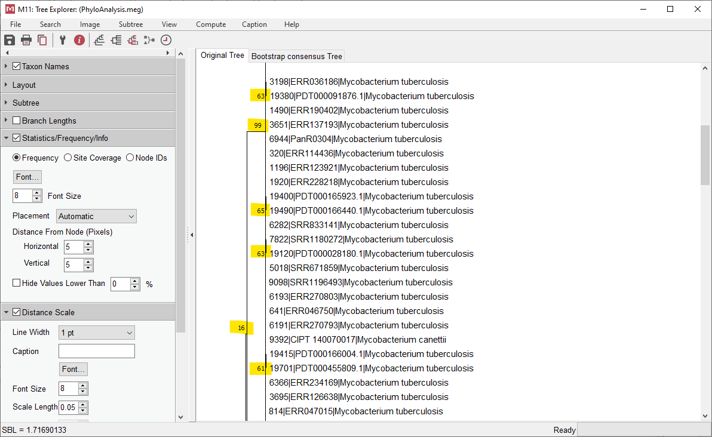

## Practical 3: Genome assembly

### Introduction
In this training you will use the Linux command line to run a bacterial genome assembly using the program SPAdes. The objective is to:

* become familiar with the bioinformatics steps involved in assembly and checking the quality of the assembly.
* understand what software is used and how it is parameterized or configured.

For this purpose we will initially start with the process of assembling contigs from raw reads. Contigs is a term that means contiguous DNA and refers to the consensus sequence that is formed when sequence reads (usually from fastq files) are ‘stitched together’ to form large regions from the genome. With short reads, repetitive sequences usually prevent complete closed genomes from being produced but instead the end result is usually smaller pieces of contiguous DNA that make up most of the genome.

### Stages in the assembly process

* Raw fastq QC assessment
* Fastq trimming
* Trimmed fastq QC assessment
* Assembly
* Assembly QC

### Introduction to "Next Generation Sequencing"
Next generation or high throughput sequencing involves massively parallel sequencing of small fragments of DNA that have been generated from an original nucleic acid source. This can be genomic DNA, PCR amplicons or cDNA generated from RNA. In this tutorial you will be working with sequence data that has been generated from whole genome DNA extracts. In this case the genomic DNA is fragmented and then Illumina adapter sequences ligated so that common sequencing primers can be used to prime from the fragments and generate sequence. The fragmentation and ligation can either be done in one step (e.g. with the enzymatic NextEra system that uses a process they call tagmentation) or in two steps such as with the TruSeq process where the DNA is sheared physically and the adapters ligated subsequently. The Illumina sequencing technology works best when the fragment size (also known as insert size) is 300 - 500bp. With paired-end sequencing both ends of the fragment are sequenced but these reads (one in the forward and one in the reverse direction) may not meet. If the insert size is too small the reads can be, and for assembly, should be merged.

At the end of the sequencing process, when paired end sequencing is used, each sample sequenced will produce a pair of fastq files corresponding to one file with all the read 1s from the fragments and in the second file all the read 2s. The order of the reads in these files is the same so that the R1 and R2 for each fragment are synchronised. However since the fragments are generated randomly in the case of library preparation from whole genomes they are not in any order in relation to the genome. This can only be achieved by giving each read context through de novo assembly or aligning (usually known as mapping) to a close reference genome.

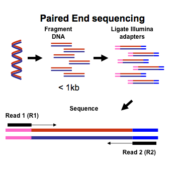

### FASTQ format
A FASTQ file normally has four lines per sequence fragment.

Line 1 begins with a '@' character and is followed by a sequence identifier and an optional description (like a FASTA title line).
Line 2 contains the sequence as letters that represent the nucleotides.
Line 3 begins with a '+' character and is optionally followed by the same sequence identifier (and any description) again.
Line 4 encodes the quality values for the sequence in Line 2, and contains the same number of symbols as letters in the sequence.
So for example  FASTQ file containing a single sequence might look like this:

```
@SEQ_ID
GATTTGGGGTTCAAAGCAGTATCGATCAAATAGTAAATCCATTTGTTCAACTCACAGTTT
+
!''*((((***+))%%%++)(%%%%).1***-+*''))**55CCF>>>>>>CCCCCCC65
```
The quality metrics are encoded as shown below (taken from https://en.wikipedia.org/wiki/FASTQ_format#Encoding). Most sequence data is now in Phred+33 format where quality ranges from 0 to 40 and is encoded as ! to J.

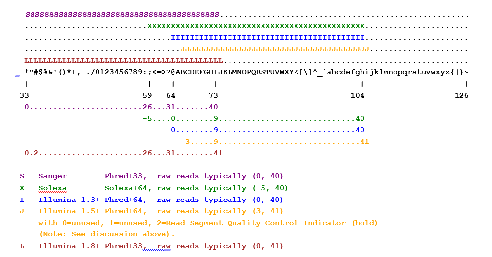

Open a terminal window and make sure that you are in your home directory. Create a directory for the assembly.

```
cd ~
mkdir assembly
```
The FASTQ files containing the short-read data can be found in a tar archive on the GitHub site for this course. Download this to the new assembly directory
```
cd assembly
wget https://github.com/WCSCourses/GCM24/raw/main/course_data/assembly/WTAC.fastq.tar
```
Extract the short-read data FASTQ files from tar archive using the `tar` command and then list the contents of the directory:
```
tar xvf WTAC.fastq.tar
ls
```
You should now see 3 files in the directory - the original tar file and the extracted forward and reverse compressed FASTQ files (WTAC_1.fastq.gz and WTAC_2.fastq.gz).

### FASTQ file QC assessment
We should first assess the quality of our FASTQ data using the fastqc tool. To check the forward traces enter:
```
fastqc WTAC_1.fastq.gz
```
This will generate a HTML output file. You can use a web browser to visualize this.
```
firefox WTAC_1_fastqc.html
```
In the web browser you should see the following output:


If you click on ‘Per base sequence quality’ you will see that the quality of this fastq file is very high. Anything above 25 is usually considered good quality.

A key step in the preparation of nucleic acid for NGS is fragmentation and there are different methods in which nucleic acids can be shortened prior to library construction. A description of these can be found at https://tinyurl.com/yadb6dvd. 

Enzymatic methods, in particular, can be used and these use nucleases or transposases to cleave DNA into small pieces. Clicking on the adapter content link will identify any contamination arising from the Nextera transposase sequence.


You will notice that this sample does not contain any contamination. This is because the nucleic acid in this example was mechanically sheared.

The figure below provides an example of what contamination with the Nextera Transposase sequence would look like suggesting that the sequencing inserts may be small in some of the sequence data. In this case the sequencing has read all the way through from one side of the insert to the other into the adapter sequences on the other side of the sequence insert. Since this is not sequence from the originating DNA this should be removed.

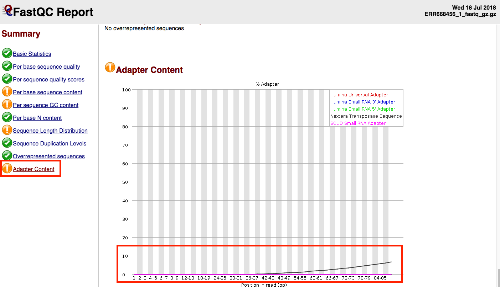

### Assembly
Finally, we come to assembly. For this we will use the SPAdes tool. We need to tell the assembler which files are the forward and reverse FASTQ files; a range of kmer sizes to try - it will automatically select the best assembly generated from each of these at the end; and that it should only run the assembler and not use error correction. Finally, as the virtual machines we are running this on are limited in memory, we can limit the memory used to 8Gb (the job will fail if it tries to use more, but as least the machine won't crash!). We also need to tell SPAdes where to save the output, so with get it to create a new directory called 'output'. Type the following - it will take a few minutes to run!
```
spades -1 WTAC_1.fastq.gz -2 WTAC_2.fastq.gz -k 21,33,43,53,63,75 --memory 8 -o output --only-assembler
```
While you are waiting you may want to read:
* the original SPAdes publication: https://www.ncbi.nlm.nih.gov/pmc/articles/PMC3342519
* the SPAdes manual: https://github.com/ablab/spades/blob/spades_3.15.4/README.md
* and if you are really keen this primer about bacterial WGS http://cmr.asm.org/content/29/4/881.full.pdf

Once SPAdes has finished running, navigate to the output directory and list the contents:
```
cd output
ls
```
You will see a number of files including:

* scaffolds.fasta - contains resulting scaffolds in fasta format (contigs joined by paired end read information but where the gaps are padded with Ns, see this article for some more details https://genome.jgi.doe.gov/help/scaffolds.jsf)
* contigs.fasta - contains resulting contigs in fasta format

### Assembly QC assessment
Now you will assess the quality of the assembly using Quast. 

Type the following to run Quast on the contigs.fasta file:

```
quast.py -o quast_output contigs.fasta
```
This will create a new output directory called 'quast_output' in the assembly directory.

There are a number of different output files in this directory. The easiest one to view is the HTML report file. Enter the output directory and load this into Firefox:

```
cd quast_output
firefox report.html
```
You will see some basic stats about the assembly. 


The critical figures to look at are:

* \# (number) of contigs: smaller the better
* Total length: this should be approximately the size of the genome expected for the species (which is ~2.2Mbp for *Neisseria meningitidis*)
* N50: larger the better (see https://en.wikipedia.org/wiki/N50,_L50,_and_related_statistics for an explanation)

Well done - you have completed a genome assembly and simple QC!

> The assembly protocol was modified from a tutorial written by Anthony Underwood.